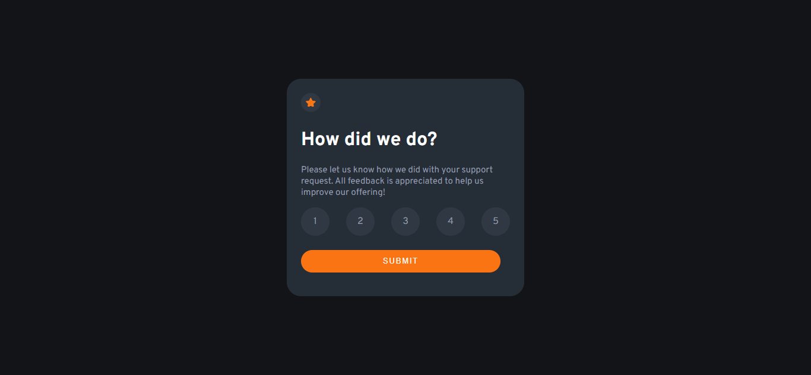

# Frontend Mentor - Interactive rating component solution

This is a solution to the [Interactive rating component challenge on Frontend Mentor](https://www.frontendmentor.io/challenges/interactive-rating-component-koxpeBUmI). Frontend Mentor challenges help you improve your coding skills by building realistic projects.

## Table of contents

- [Overview](#overview)
  - [The challenge](#the-challenge)
  - [Screenshot](#screenshot)
  - [Links](#links)
- [My process](#my-process)
  - [Built with](#built-with)
  - [What I learned](#what-i-learned)
  - [Continued development](#continued-development)
  - [Useful resources](#useful-resources)
- [Author](#author)
- [Acknowledgments](#acknowledgments)

## Overview

### The challenge

Users should be able to:

- View the optimal layout for the app depending on their device's screen size
- See hover states for all interactive elements on the page
- Select and submit a number rating
- See the "Thank you" card state after submitting a rating

### Screenshot



### Links

- Solution URL: https://github.com/prettyBcoding/Interactive-Rating
- Live Site URL: https://prettybcoding.github.io/Interactive-Rating

## My process

### Built with

- Semantic HTML5 markup
- CSS custom properties
- Flexbox
- CSS Grid
- JavaScript

### What I learned

This porject blow my mind a little bit just because this project was the first one I did after 5 months without coding. While I was working on this project I had difficulty to active a number and remove active class at the same, but after some researches I finally did it. And this is how I did:

```html
<div class="rating">
  <span class="rating-numbers">1</span>
  <span class="rating-numbers">2</span>
  <span class="rating-numbers">3</span>
  <span class="rating-numbers">4</span>
  <span class="rating-numbers">5</span>
</div>
```
```css
.rating {
  display: grid;
  justify-content: center;
  grid-template-columns: auto auto auto auto auto;
  column-gap: 1.75rem;
}

.rating-numbers {
  background-color:	#303843;
  border-radius: 50%;
  color: 	#959eac;
  display: flex;
  justify-content: center;
  align-items: center;
  height: 3rem;
  width: 3rem;
}

.rating-numbers:hover {
  background-color:	#7c8798;
  color: #ffffff;
  cursor: pointer;
}

.clicked {
  background-color: #fb7413;
  color: #ffffff;
}
```
```js
$(".rating").click(function (e) {
  e.preventDefault();
  const clicked = e.target.closest(".rating-numbers");


  // remove active classes
  [...clicked.parentElement.children].forEach((click) => {
    if (click != clicked) click.classList.remove("clicked");
  });

  clicked.classList.add("clicked");
  $(".ratingNumber").html(clicked.innerHTML);
});
```

### Continued development

Now I continue to improve my skils, doing more challenges and we're going.


## Author

- Frontend Mentor - [@prettyBcoding](https://www.frontendmentor.io/profile/prettyBcoding)
